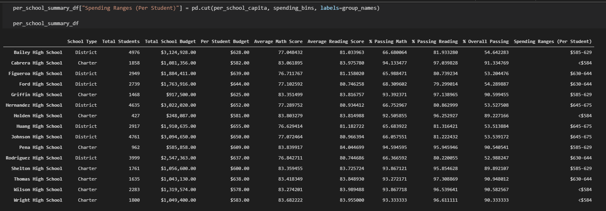

# School District Analysis
Python 3.7 project to prepare school district's standardized test math and reading scores for analysis, reporting, and presentation to showcase trends in school performance that will assist the school board and superintendent in making decisions on school budgets and priorities.

This project uses Jupyter Notebook and the Pandas library to read raw data from CSV files, inspect and clean data, merge datasets, perform mathematical calculations, and visualize the data with charts and graphs.

## School District Summary
The school district summary is a high-level snapshot of the district's key metrics:

  -  Total number of students
  -  Total number of schools
  -  Total budget
  -  Average math score
  -  Average reading score
  -  Percentage of students who passed math
  -  Percentage of students who passed reading
  -  Overall passing percentage

## Per School Summary
per_school_summary_df with:

  -  Type of school in the "School Type" column
  -  Total students per school in the "Total Students" column
  -  Total budget per school in the "Total School Budget" column
  -  Total budget per student for each school in the "Per Student Budget" column
  -  Average math score for each school in the "Average Math Score" column
  -  Average reading score for each school in the "Average Reading Score" column
  -  Percentage of students passing math for each school in the "% Passing Math" column
  -  Percentage of students passing reading for each school in the "% Passing Reading" column
  -  Overall passing percentage for each school in the "% Overall Passing" column

## School Spending Per Student
To help the school board make decisions about the budget for the upcoming school year, school spending per student report was added to explore how school spending per student affects the school's average scores and passing percentages.    

The list of deliverables for the analysis of the school district:
 - A high-level snapshot of the district's key metrics, presented in a table format
 - An overview of the key metrics for each school, presented in a table format

Tables presenting each of the following metrics:
  -  Top 5 and bottom 5 performing schools, based on the overall passing rate
  -  The average math score received by students in each grade level at each school
  -  The average reading score received by students in each grade level at each school
  -  School performance based on the budget per student
  -  School performance based on the school size 
  -  School performance based on the type of school

[Back To The Top](#School District Analysis)